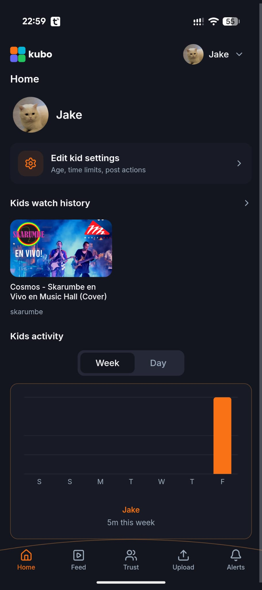
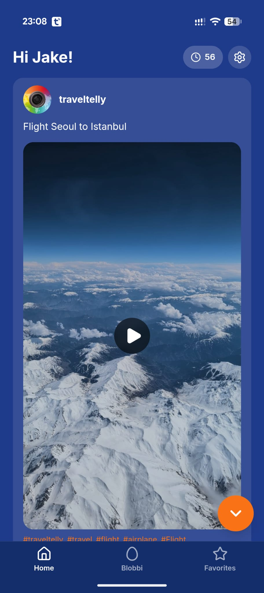
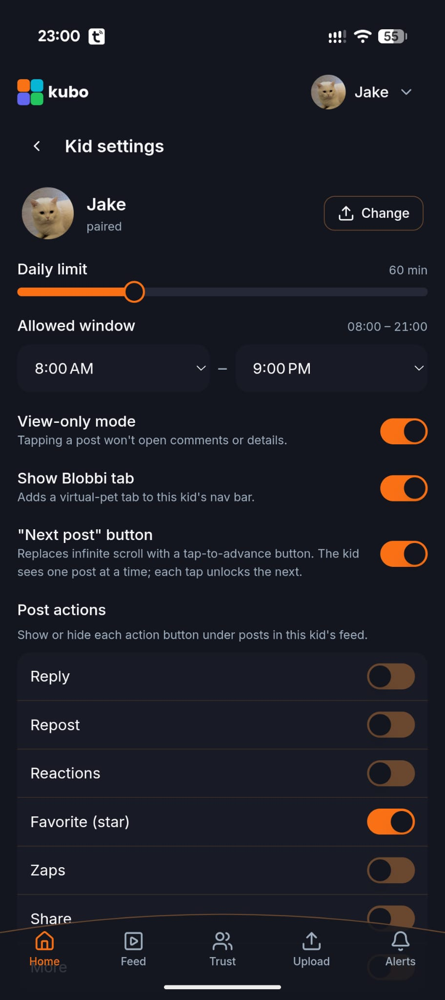
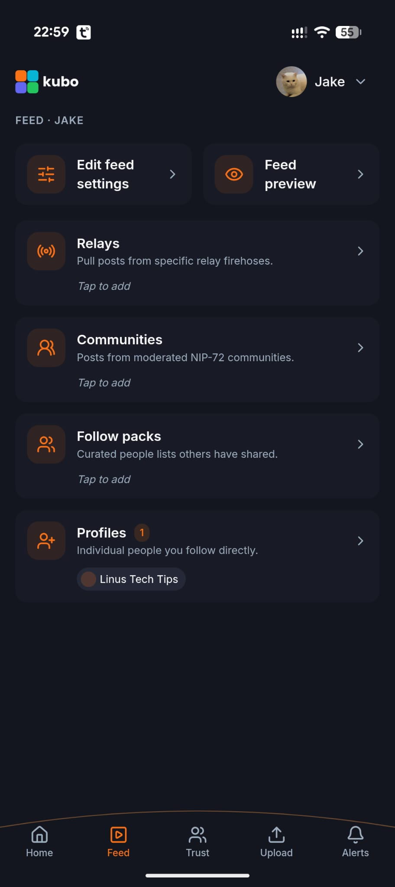
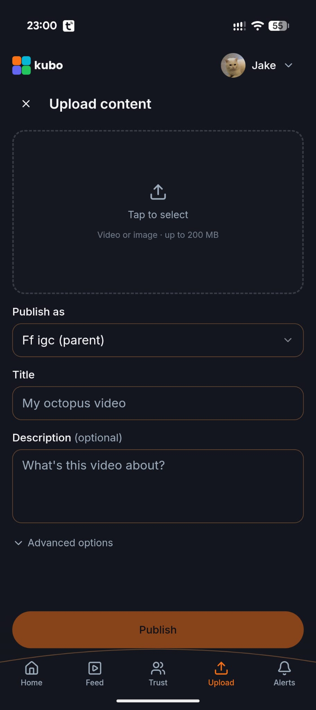

# Kubo

Safe social for kids. A child-safe video platform built on [Nostr](https://nostr.com/) that lets parents curate their child's content world through Web of Trust filters.

**[kubo.watch](https://kubo.watch)** | **[Source](https://github.com/JeroenOnNostr/kubo)**

## About

Kubo gives parents full agency over what their children can watch. Instead of relying on opaque algorithms, Kubo uses real relationships to curate content -- you explicitly approve family members, friends, and communities who can contribute to your child's content experience. Built on the Trust Extended Permissions Protocol (TEPP) and the Nostr protocol, every piece of content is traceable back to someone you trust.

Build your child's content world from the inside out -- starting with your inner circle, expanding to friends of friends, and extending it with communities.

## Screenshots

<p align="center">
  
  
  
</p>
<p align="center">
  
  
</p>

## Features

### Parent controls
- **Dashboard** -- See your kid's watch history and weekly activity at a glance
- **Time limits** -- Set daily screen time (15--180 min) and an allowed time window
- **Per-child settings** -- Each child gets their own profile with age-appropriate controls
- **Post actions** -- Toggle which actions (reply, repost, reactions, zaps) are visible per child
- **View-only mode** -- Disable post navigation so kids can only watch, not browse
- **Scroll cap** -- Replace infinite scroll with a "Next post" button so kids see one post at a time

### Trust system
- **Three trust levels** -- View, Interact, and Extend -- giving you granular control over who shapes your child's feed
- **People & places** -- Assign trust to individual profiles or entire communities
- **Full transparency** -- You see exactly who approved what content

### Kid experience
- **Video-first feed** -- Clean, distraction-free interface focused on video content
- **Favorites** -- Kids can star posts they love
- **Blobbi** -- Optional virtual pet companion tab
- **Parent gate** -- 6-digit code required for any setting changes

### Feed curation
- **Relays** -- Pull content from specific Nostr relays
- **Communities** -- Add moderated NIP-72 communities
- **Follow packs** -- Import curated people lists others have shared
- **Profiles** -- Follow individual creators directly
- **Feed preview** -- Preview your child's feed before they see it

### Built on Nostr
- **Decentralized** -- No single company controls the content or the platform
- **Own your identity** -- Parent and child keys are real Nostr keypairs
- **Content upload** -- Publish videos and images (up to 200 MB) directly from the app

## How it works

1. **Create a parent account** -- Sign up with a Nostr keypair (or create one)
2. **Add your kids** -- Create a child profile with their own keypair
3. **Curate their feed** -- Add relays, communities, follow packs, and individual profiles as content sources
4. **Set trust levels** -- Decide who can contribute content (view, interact, or extend)
5. **Configure safety** -- Set time limits, allowed hours, and toggle post actions
6. **Hand over the phone** -- Your kid gets a simple, filtered feed with only the content you approved

## Getting Started

### Prerequisites

- [Node.js](https://nodejs.org/) 22+
- npm 10.9.4+

### Development

```sh
git clone https://github.com/JeroenOnNostr/kubo.git
cd kubo
npm install
npm run dev
```

The dev server starts at `http://localhost:8080`.

### Build

```sh
npm run build
```

The built site is output to `dist/`.

### Android

Build a native Android app with [Capacitor](https://capacitorjs.com/):

```sh
npm run build
npx cap sync
npx cap open android
```

## Tech Stack

| Layer | Technology |
|---|---|
| Framework | React 18 |
| Build | Vite |
| Language | TypeScript |
| Styling | TailwindCSS 3 + shadcn/ui |
| Routing | React Router 6 |
| Data | TanStack Query |
| Nostr | Nostrify + nostr-tools |
| Mobile | Capacitor |
| Testing | Vitest + React Testing Library |

## Acknowledgments

Kubo is a fork of [Ditto](https://github.com/soapbox-pub/ditto) by [Soapbox](https://soapbox.pub). Ditto provides the excellent Nostr client foundation that Kubo builds its child-safety features on top of.

## License

[AGPL-3.0](LICENSE)
